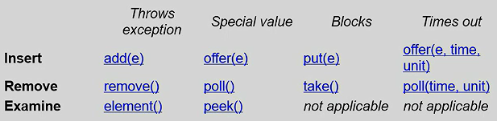

# 多线程

**优势**

+ 充分利用多处理器
+ 可以异步处理任务

**挑战**

+ 数据会被多个线程访问，有安全性问题
+ 不活跃的线程也会占用内存资源
+ 死锁

**Thread**

+ extends Thread,重写run()方法
+ implements Runnable,实现run()方法

**Synchronized（内置锁）**

+ 放在方法上会锁住整个方法
+ Synchronized(obj)锁住相关的代码段：同一把锁，两把不同的锁

**Atomic**

见代码

**BlockingQueue/同步队列** 

  

通过BlockingQueue这样中间的一条队列能够实现异步，一边在put，另一边在take。后面讲到的异步处理框架也是同样的思想，只不过使用的不是BlockingQueue，而是Redis，即只是存放的地方不同而已。

**ThreadLocal**

1. 线程局部变量，对于一个变量来说，每个线程都有一个副本。即使是一个static成员，每个线程访问的变量是不同的。
2. 在web中常用于存储当前用户到一个静态工具类中，在线程的任何地方都可以访问到当前线程的用户。（参考HostHolder.java中的users）

**Executor框架**

作为灵活且强大的异步执行框架，其支持多种不同类型的任务执行策略，提供了一种标准的方法将任务的提交过程和执行过程解耦开发，基于生产者-消费者模式，其提交任务的线程相当于生产者，执行任务的线程相当于消费者，并用Runnable来表示任务，Executor的实现还提供了对生命周期的支持，以及统计信息收集，应用程序管理机制和性能监视等机制。

1. 提供一个运行任务的框架；
2. 将任务和如何运行任务解耦；
3. 常用于提供线程池或定时任务服务。

**Future**

异步,即主线程get阻塞，等待返回结果（可以设置timeout），这是主线程与new线程间的简单通信（详见代码）：
1. 主线程异步获取new线程执行的结果
2. 主线程异步获取new线程抛出Exception

此外，多线程还有信号量、各种各样的方法锁以及临界区等。